# FIP Archival System

> Automatically archive approved Filecoin Improvement Proposals (FIPs) to permanent decentralized storage with cryptographic proof.

[](https://github.com/timfong888/filecoin-pin/blob/master/.github/workflows/archive-fip.yml)
[](https://ipfs.io)
[](https://filecoin.io)

## What This Does

When someone comments **"FIP approved"** on a GitHub issue, this system automatically:

1. **Extracts complete FIP data** - Issue body, all comments, linked PRs with code diffs
2. **Creates self-contained archive** - HTML pages with working navigation and clickable links
3. **Uploads to Filecoin** - Permanent decentralized storage with PDP cryptographic proof
4. **Returns verification** - IPFS gateway URLs, blockchain transaction, Piece CID

## Why This Matters

FIPs are critical governance documents for the Filecoin network. This ensures:

- **Permanent preservation** - FIPs stored on the network they govern
- **Cryptographic proof** - PDP (Proof of Data Possession) verifies ongoing storage
- **Self-contained records** - Complete history with all discussions and code changes
- **Public verifiability** - Anyone can verify archives on-chain
- **IPFS gateway access** - View archives via ipfs.io or dweb.link with all links working

## Live Demo

**Production System**: https://github.com/timfong888/FIPs

Comment "FIP approved" on any issue to see it in action!

## Key Features

### 🌐 IPFS Gateway Compatible

Archives are viewable via any IPFS gateway with **all internal links working**:

```
https://ipfs.io/ipfs/[ROOT_CID]/index.html
https://dweb.link/ipfs/[ROOT_CID]/index.html
```

**What makes this special:**
- ✅ Click through to PR pages
- ✅ View code diffs inline
- ✅ Read all comments
- ✅ Navigate between sections
- ✅ Works offline once downloaded
- ✅ No broken external links

### 🔗 Complete Data Extraction

Each archive includes:
- **index.html** - Main navigation page with full issue content
- **pull-requests/pr-{N}.html** - Individual PR pages with descriptions
- **pull-requests/diff-{N}.patch** - Complete code diffs
- **comments.md** - All discussion in chronological order
- **metadata.json** - Machine-readable archive metadata
- **verification.json** - Filecoin storage proof (Piece CID, transaction hash)

### 🔐 Cryptographic Verification

Every archive includes:
- **Piece CID** - Filecoin content identifier
- **Root CID** - IPFS content identifier
- **Transaction Hash** - Blockchain verification
- **Data Set ID** - On-chain storage tracking
- **Download URL** - Direct retrieval from storage provider

## How It Works

```mermaid
graph LR
    A["FIP approved" comment] --> B[GitHub Action Triggers]
    B --> C[Extract Issue Data]
    C --> D[Extract Comments]
    D --> E[Extract Linked PRs]
    E --> F[Create HTML Archive]
    F --> G[Upload to Filecoin]
    G --> H[Generate Verification]
    H --> I[Post IPFS Gateway Links]
```



### Detailed Flow

1. **Trigger**: User comments "FIP approved" on any issue
2. **Extraction** (~30 seconds):
   - Fetch issue metadata and body
   - Fetch all comments with timestamps
   - Find linked PRs via #123 references
   - Download PR descriptions and diffs
3. **Archive Creation** (~5 seconds):
   - Generate HTML index with navigation
   - Create HTML pages for each PR
   - Use relative links for IPFS compatibility
   - Include metadata and timestamps
4. **Upload to Filecoin** (~30-60 seconds):
   - Package as CAR file
   - Upload via filecoin-pin CLI
   - Create payment rails
   - Wait for PDP proof generation
5. **Verification** (~5 seconds):
   - Extract Piece CID and Root CID
   - Get blockchain transaction hash
   - Generate IPFS gateway URLs
6. **Comment** (~2 seconds):
   - Post links to IPFS gateways
   - Include blockchain verification
   - Provide download URLs

## Quick Start

### For Repository Owners

1. **Fork this repository**
   ```bash
   gh repo fork timfong888/filecoin-pin
   ```

2. **Set GitHub secrets**
   ```bash
   gh secret set FILECOIN_PRIVATE_KEY --repo your-org/your-repo
   # Paste your Filecoin wallet private key
   ```

3. **Fund your wallet**
   - Get tFIL: https://faucet.calibnet.chainsafe-fil.io/funds.html
   - Get USDFC: https://stg.usdfc.net
   - Setup payments: `filecoin-pin payments setup --auto --deposit 50`

4. **Test it**
   ```bash
   gh issue comment 1 --body "FIP approved" --repo your-org/your-repo
   ```

### For Developers

Clone and customize:

```bash
git clone https://github.com/timfong888/filecoin-pin.git
cd filecoin-pin

# Review the archival script
cat scripts/archive-fip.js

# Review the GitHub Action
cat .github/workflows/archive-fip.yml

# Test locally (dry run)
export GITHUB_TOKEN="ghp_..."
node scripts/archive-fip.js --issue 1 --repo filecoin-project/FIPs --dry-run

# View the archive
open fip-1-archive/index.html
```

## Archive Structure

```
fip-{number}-archive/
├── index.html              # Main page with navigation
├── issue.md                # Original issue in markdown
├── comments.md             # All comments chronologically
├── pull-requests/
│   ├── pr-123.html        # PR page with navigation
│   ├── pr-123.md          # PR in markdown
│   ├── diff-123.patch     # Complete code diff
│   ├── pr-456.html
│   └── diff-456.patch
├── metadata.json           # Archive metadata
└── verification.json       # Filecoin proof
```

### HTML Navigation Example

From `index.html`, users can:
- Click "Pull Requests" → `pull-requests/pr-123.html`
- Click "View diff" → `pull-requests/diff-123.patch`
- Click "← Back to FIP" → `index.html`

**All relative links** work via IPFS gateways!

## GitHub Action Workflow

The action runs on `issue_comment` events:

```yaml
name: Archive FIP to Filecoin

on:
  issue_comment:
    types: [created]

jobs:
  archive:
    if: contains(github.event.comment.body, 'FIP approved')
    runs-on: ubuntu-22.04
    steps:
      - name: Setup Node.js 22
      - name: Install filecoin-pin CLI
      - name: Extract FIP data
      - name: Upload to Filecoin
      - name: Comment with verification
```

See full workflow: [`.github/workflows/archive-fip.yml`](.github/workflows/archive-fip.yml)

## Configuration

### Required Secrets

| Secret | Description | Example |
|--------|-------------|---------|
| `FILECOIN_PRIVATE_KEY` | Wallet private key (testnet) | `0x1234...` |

### Optional Environment Variables

| Variable | Description | Default |
|----------|-------------|---------|
| `FILECOIN_RPC_URL` | Filecoin RPC endpoint | `https://api.calibration.node.glif.io/rpc/v1` |
| `GITHUB_TOKEN` | GitHub API access | Auto-provided by Actions |

## Manual Usage

### Archive Any Issue

```bash
# Set environment
export PRIVATE_KEY="0x..."
export RPC_URL="https://api.calibration.node.glif.io/rpc/v1"
export GITHUB_TOKEN="ghp_..."

# Archive an issue
node scripts/archive-fip.js --issue 123 --repo filecoin-project/FIPs

# Dry run (no upload)
node scripts/archive-fip.js --issue 123 --repo filecoin-project/FIPs --dry-run

# Custom output directory
node scripts/archive-fip.js --issue 123 --output ./my-archive/
```

### Verify Archive on Filecoin

```bash
# From verification.json
PIECE_CID=$(jq -r '.pieceCid' fip-123-archive/verification.json)
ROOT_CID=$(jq -r '.rootCid' fip-123-archive/verification.json)
TX_HASH=$(jq -r '.transactionHash' fip-123-archive/verification.json)

# View on blockchain explorer
open "https://calibration.filfox.info/tx/$TX_HASH"

# View via IPFS gateway
open "https://ipfs.io/ipfs/$ROOT_CID/index.html"

# Download and verify
curl -o archive.car "https://calib.ezpdpz.net/piece/$PIECE_CID"
npm install -g ipfs-car
ipfs-car ls archive.car
```

## Cost Estimates

On Calibration testnet:

| Archive Size | USDFC Cost | Storage Time |
|--------------|------------|--------------|
| < 1 MB | ~5 USDFC | Indefinite |
| 1-5 MB | ~10 USDFC | Indefinite |
| 5-10 MB | ~20 USDFC | Indefinite |

**Note**: These are testnet estimates. Mainnet pricing may vary.

## Examples

### Example Bot Comment

After successful archival:

```markdown
## ✅ FIP Archive Complete

### 📦 Archive Details
- **Issue:** #123
- **Archived:** 2025-10-11T16:00:00Z

### 🔗 Filecoin Verification
| Field | Value |
|-------|-------|
| **Piece CID** | `bafkzcib...` |
| **Root CID** | `bafy...` |
| **Transaction** | [View on Explorer](https://calibration.filfox.info/tx/0x...) |

### 📥 Access Archive
- 🌐 **IPFS Gateway:** [View on ipfs.io](https://ipfs.io/ipfs/bafy.../index.html)
- 🌐 **Alternative Gateway:** [View on dweb.link](https://dweb.link/ipfs/bafy.../index.html)

> **Note:** All links within the archive work when viewed via IPFS gateways!
```

### Example Archive Contents

Visit a live archive via IPFS gateway and:
1. Read the original FIP issue
2. Click through to linked pull requests
3. View code changes inline
4. Read all discussion comments
5. Navigate back to the main page

**Everything works offline** once the CAR file is downloaded!

## Architecture

Built on:

- **[filecoin-pin](https://github.com/filecoin-project/filecoin-pin)** - CLI for Filecoin uploads
- **[Synapse SDK](https://github.com/filecoin-project/synapse-sdk)** - Payment rails and storage management
- **[PDP Protocol](https://github.com/filecoin-project/pdp)** - Proof of Data Possession
- **GitHub Actions** - Automation platform
- **GitHub CLI (gh)** - API access for data extraction

## Troubleshooting

### "No USDFC tokens found"

```bash
filecoin-pin payments status
# Get USDFC from: https://stg.usdfc.net
```

### "Payment setup required"

```bash
filecoin-pin payments setup --auto --deposit 50
```

### "GitHub API rate limit"

```bash
# Use authenticated gh CLI
gh auth login
```

### "Action didn't trigger"

- Check comment contains exact text: "FIP approved"
- Verify secrets are set correctly
- Check action permissions in repository settings

## Development

### Running Tests

```bash
npm install
npm test
```

### Local Testing

```bash
# Install dependencies
npm install -g filecoin-pin

# Set environment
export PRIVATE_KEY="0x..."
export RPC_URL="https://api.calibration.node.glif.io/rpc/v1"
export GITHUB_TOKEN="ghp_..."

# Test archive creation (no upload)
node scripts/archive-fip.js --issue 1 --repo filecoin-project/FIPs --dry-run

# View the result
open fip-1-archive/index.html
```

### Customization

Edit `scripts/archive-fip.js` to:
- Change HTML styling
- Add custom metadata fields
- Modify extraction logic
- Customize output format

## Documentation

- **[QUICKSTART.md](QUICKSTART.md)** - 5-minute setup guide
- **[TESTING.md](TESTING.md)** - Comprehensive testing guide
- **[README-ORIGINAL.md](README-ORIGINAL.md)** - Original filecoin-pin documentation
- **[Demo Walkthrough](../demo-walkthrough/DEMO_WALKTHROUGH.md)** - filecoin-pin CLI usage

## Status

**⚠️ Alpha Software** - Currently running on Filecoin Calibration testnet only. Not for production use.

**Live Production System**: https://github.com/timfong888/FIPs

## Contributing

Contributions welcome! Please:

1. Fork the repository
2. Create a feature branch
3. Make your changes
4. Test thoroughly
5. Submit a pull request

## Roadmap

- [ ] Mainnet support
- [ ] Archive search/indexing
- [ ] Multi-repo deployment
- [ ] Archive versioning
- [ ] Metadata enrichment
- [ ] API for programmatic access

## License

Dual-licensed under MIT + Apache 2.0 (same as upstream filecoin-pin)

## References

- [Filecoin Pin Demo](../demo-walkthrough/DEMO_WALKTHROUGH.md)
- [IPFS Pinning Service API](https://ipfs.github.io/pinning-services-api-spec/)
- [Synapse SDK](https://github.com/filecoin-project/synapse-sdk)
- [PDP Protocol](https://github.com/filecoin-project/pdp)
- [Filecoin Documentation](https://docs.filecoin.io)

## Related Projects

- **[filecoin-project/filecoin-pin](https://github.com/filecoin-project/filecoin-pin)** - Upstream project
- **[filecoin-project/FIPs](https://github.com/filecoin-project/FIPs)** - Official FIPs repository
- **[timfong888/FIPs](https://github.com/timfong888/FIPs)** - This system deployed

## Support

For issues and questions:
- **Issues**: https://github.com/timfong888/filecoin-pin/issues
- **Discussions**: https://github.com/timfong888/filecoin-pin/discussions

---

**Built with** ❤️ **using Filecoin, IPFS, and the power of decentralized storage**
